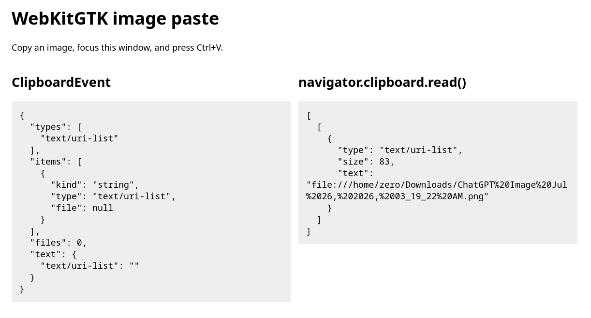
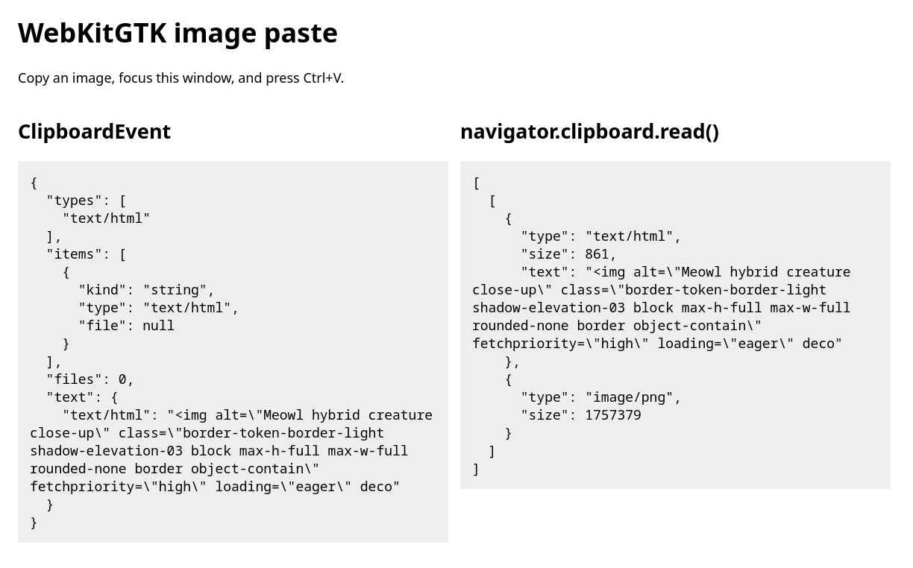

# WebKitGTK image paste repro

Compares the data exposed by `ClipboardEvent.clipboardData` and
`navigator.clipboard.read()` when pasting images into WebKitGTK.

## Run

```sh
./run.sh
```

## Results

### Local image file



Copying a local PNG exposes only `text/uri-list`; neither API returns image bytes.

### Rendered image



Copying a rendered image exposes HTML to `ClipboardEvent`, while the async API also returns `image/png`.

## Environment

- WebKitGTK: 2.52.3
- GTK: 3.24.52
- Desktop: KDE Plasma 6.6.4
- Session: Wayland
